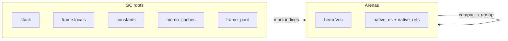
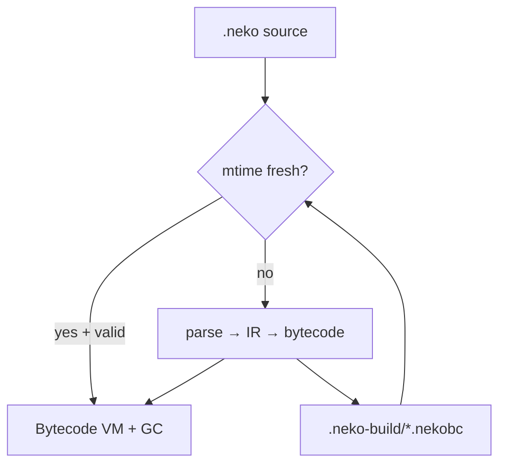

# VM memory management and bytecode cache

This document describes how the Neko bytecode VM reclaims memory under load and how compiled
programs are cached on disk as `.nekobc` files.

For high-level architecture, see [DECISIONS.md](DECISIONS.md). For error codes, see
[ERRORS.md](ERRORS.md).

---

## Overview

Neko uses a **two-layer** memory model on the bytecode VM:

| Layer | Mechanism | What it manages |
|-------|-----------|-----------------|
| Nested values | Rust `Rc<RefCell<Value>>` | Arrays, objects, strings inside a heap slot |
| VM arenas | Mark-and-compact GC | Indexed `FastVal::Heap` / `FastVal::Native` slots |

Primitives (`int`, `float`, `bool`, `nil`) live on the VM stack as `FastVal` and never
touch the arenas. Boxed values and native DSA handles are stored in append-only arena
vectors and referenced by index from the stack and locals.

Before mark-and-compact GC, arena slots were never freed during a run — loops that
allocated and discarded values could grow memory until process exit. GC compacts unreachable
arena slots while the program is still running.

**Bytecode cache** — `neko run` and `neko build` share a project-local cache directory
(`.neko-build/` by default) so re-runs skip parse → IR → bytecode when the source is
unchanged.

**Turbo JIT** — hot integer loops may compile to native code via Cranelift. Set
`NEKO_NO_JIT=1` to disable JIT and use the micro-op turbo tier only (useful for debugging).

---

## VM garbage collection

### Arenas

The VM maintains two parallel indexed stores:

| Arena | Rust storage | `FastVal` tag |
|-------|--------------|---------------|
| Object heap | `heap: Vec<ValueRef>` | `FastVal::Heap(u32)` |
| Native store | `native_ds` + `native_refs` | `FastVal::Native(u32)` |

`ValueRef` is `Rc<RefCell<Value>>`. Nested `Value::Array` / `Value::Object` elements are
ordinary `Rc` handles inside a live heap cell — the collector only needs to mark **top-level
arena indices** reachable from roots. When a heap slot is removed during compaction, Rust
drop cleans up nested `Rc` data.

### Algorithm: mark-and-compact

Implemented in [`crates/neko_vm/src/gc.rs`](../crates/neko_vm/src/gc.rs).

```
1. Mark   — set bits for every Heap/Native index reachable from roots
2. Compact — copy live slots into new vectors; build old_index → new_index maps
3. Remap  — rewrite FastVal indices in all roots using the maps
4. Replace — swap in compacted heap and native vectors
```

**GC roots** (everything that may hold a `FastVal::Heap` or `FastVal::Native`):

- `stack`
- `frames[].locals`
- `constants`
- `frame_pool` (reused local slot vectors)
- `memo_caches` (per-function memoization tables)

Unmapped indices become `FastVal::Nil` (defensive).

### When collection runs

`maybe_collect()` is called at the **start of each opcode dispatch loop** iteration (not
mid-instruction, to avoid borrow conflicts during binops).

Collection is attempted when **either**:

- `alloc_since_gc >= 4096` (`GC_INTERVAL`), or
- `heap.len() + native_ds.len() >= gc_threshold` (starts at **8192**)

Collection is **skipped** when both `frames` and `stack` are empty (program finished).

**Adaptive threshold** after each collection:

- If live ratio &lt; 50% → halve threshold (minimum 512)
- If live slots &gt; 75% of threshold → double threshold (maximum 1_048_576)

### Allocation API

All arena growth goes through:

- `alloc_heap(value: ValueRef) -> u32` — object heap slot
- `alloc_native(ds) -> FastVal` — native DSA handle

`fast_val.rs` routes heap pushes through a `HeapAlloc` trait and `HeapMut` wrapper so
opcode handlers can allocate without conflicting borrows.

Module load (`load_module`) clears arenas and resets `alloc_since_gc` / `gc_threshold`.

### Memoization bounds

Recursive functions compiled with memoization (`fib`, etc.) use a per-function cache capped
at **65 536** entries (`MEMO_CACHE_CAP`). When full, the **oldest** entry is evicted
(FIFO). Updates to an existing key do not evict.

### What GC does *not* cover

| Area | Behavior |
|------|----------|
| Interpreter | Tree-walking interpreter uses `Rc` only; no VM arena GC |
| `Rc` cycles | Closures / environments can still leak if cyclic; no cycle collector |
| `bench` | Compiles in memory each run; no interaction with GC arenas across runs |

### Verifying GC behavior

```bash
cargo test -p neko_vm gc
cargo run --release --bin neko -- run tests/gc_heap.neko
```

`tests/gc_heap.neko` loops 100 000 times creating small arrays that go out of scope each
iteration. Rust tests assert `heap_len() < 10_000` after the run.

---

## Bytecode cache (`.nekobc`)

### What is a `.nekobc` file?

A **JSON-serialized** [`BytecodeModule`](../crates/neko_bytecode/src/lib.rs): opcode
streams, constants, call targets, optional whole-program fast path, and cache metadata.

It is **not** a raw binary opcode dump. The on-disk format is UTF-8 JSON for debuggability
and forward-compatible serde fields.

### Where caches live

| Command | Default output directory | Example |
|---------|------------------------|---------|
| `neko run <file>` | `<cwd>/.neko-build/` | `examples/factorial.neko` → `.neko-build/examples_factorial.nekobc` |
| `neko build <file>` | `<cwd>/.neko-build/` (override with `-o`) | same path rule |

**Path key** — relative path from current working directory, with `/` and `\` replaced by
`_`, and `.neko` stripped from the stem:

```
examples/factorial.neko  →  .neko-build/examples_factorial.nekobc
src/main.neko            →  .neko-build/src_main.nekobc
a/foo.neko vs b/foo.neko →  distinct keys (no stem collision)
```

Sidecar `source.nekobc` files next to `.neko` sources are **no longer written** by
`neko run`. Old sidecar files are ignored.

Both `.neko-build/` and `*.nekobc` are listed in [`.gitignore`](../.gitignore).

### Load / compile flow

```
neko run file.neko
  → cache_path(file, .neko-build/)
  → if cache exists AND mtime fresh AND deserialize valid
       → load BytecodeModule, ensure_fast_path()
  → else
       → parse → compile_to_bytecode → write cache → run VM
```

Implemented in [`crates/neko_cli/src/cache.rs`](../crates/neko_cli/src/cache.rs).

### Cache invalidation

A cached module is reused only when **all** of the following hold:

1. **Source mtime** — cache file modified time ≥ source modified time
2. **`cache_version`** — matches `BYTECODE_CACHE_VERSION` in `neko_bytecode`
3. **`builtin_fingerprint`** — matches current runtime builtin table
4. **Call targets** — builtin names at compile-time indices still match runtime order

If any check fails, the cache is recompiled and overwritten.

### Atomic writes

Cache files are written as `*.nekobc.tmp` then renamed to `*.nekobc`. If the write fails
(e.g. permissions), `neko run` prints a **warning** and still executes the program.

`neko build` propagates write errors (uses `write_cache_atomic` with `Result`).

### Metadata

`BytecodeModule.source_path` stores the canonical source path at compile time (optional,
backward-compatible `None` in older caches). Primary invalidation remains mtime +
version + fingerprint.

### Commands that bypass disk cache

| Command | Cache behavior |
|---------|----------------|
| `neko bench` | Compiles in memory only |
| `neko test` | Interpreter path |
| `--mode interp` | No bytecode / no `.nekobc` |

### Verifying cache behavior

```bash
cargo test -p neko_cli cache
neko run examples/factorial.neko    # creates .neko-build/examples_factorial.nekobc
neko build examples/factorial.neko  # same path under default -o .neko-build
```

---

## Source file map

| File | Responsibility |
|------|----------------|
| [`crates/neko_vm/src/gc.rs`](../crates/neko_vm/src/gc.rs) | Mark-compact GC, memo cap, GC tests |
| [`crates/neko_vm/src/lib.rs`](../crates/neko_vm/src/lib.rs) | VM dispatch, `maybe_collect`, allocation sites |
| [`crates/neko_vm/src/fast_val.rs`](../crates/neko_vm/src/fast_val.rs) | `FastVal`, `HeapAlloc`, stack representations |
| [`crates/neko_cli/src/cache.rs`](../crates/neko_cli/src/cache.rs) | Cache path, load/compile, atomic I/O, tests |
| [`crates/neko_cli/src/main.rs`](../crates/neko_cli/src/main.rs) | `run` / `build` wiring |
| [`crates/neko_bytecode/src/lib.rs`](../crates/neko_bytecode/src/lib.rs) | `BytecodeModule`, serialize, `BYTECODE_CACHE_VERSION` |
| [`tests/gc_heap.neko`](../tests/gc_heap.neko) | GC load smoke program |

---

## Diagrams

### GC root → arena flow



### Run pipeline with cache


